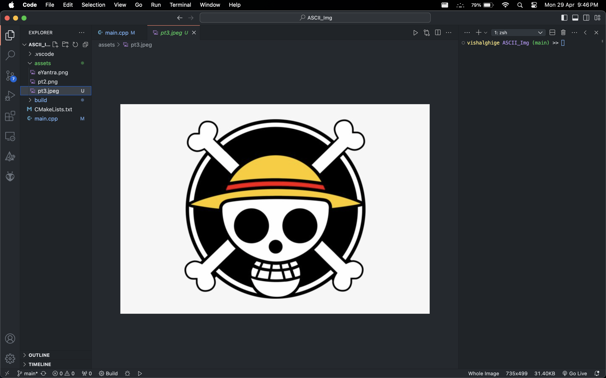
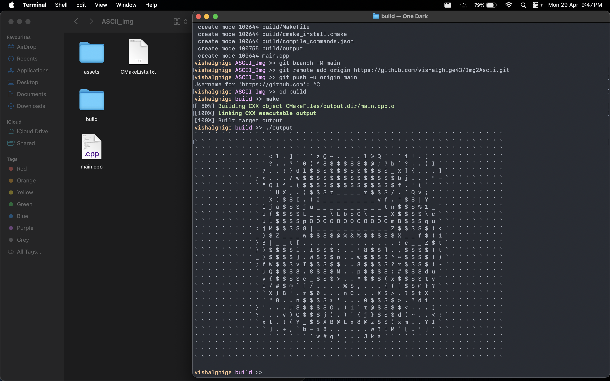

# Image2ASCII Text Converter

This is a simple fun project that converts an image into ASCII text format using C++ and OpenCV.

## Usage

To use this program, follow these steps:

1. Clone the repository to your local machine:

```bash
git clone https://github.com/vishalghige43/Img2Ascii.git
```

2. Build the project using CMake:

```bash
cd image2Ascii
mkdir build
cd build
cmake ..
make
```

3. Run the executable with the path to the input image:
```bash
./image2ascii
```
## Examples

### Input Image


### Output Image



## Dependencies

This project requires the following dependencies:

- C++ compiler
- CMake
- OpenCV